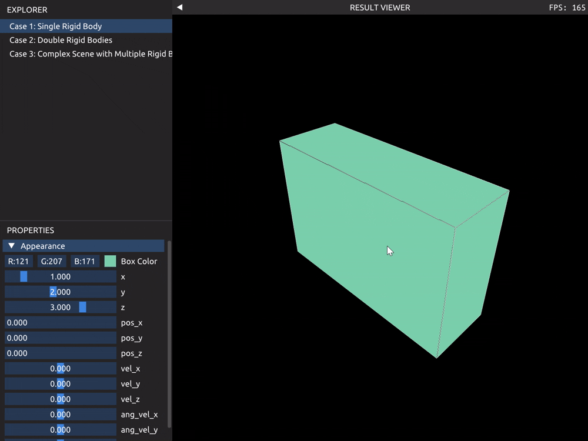
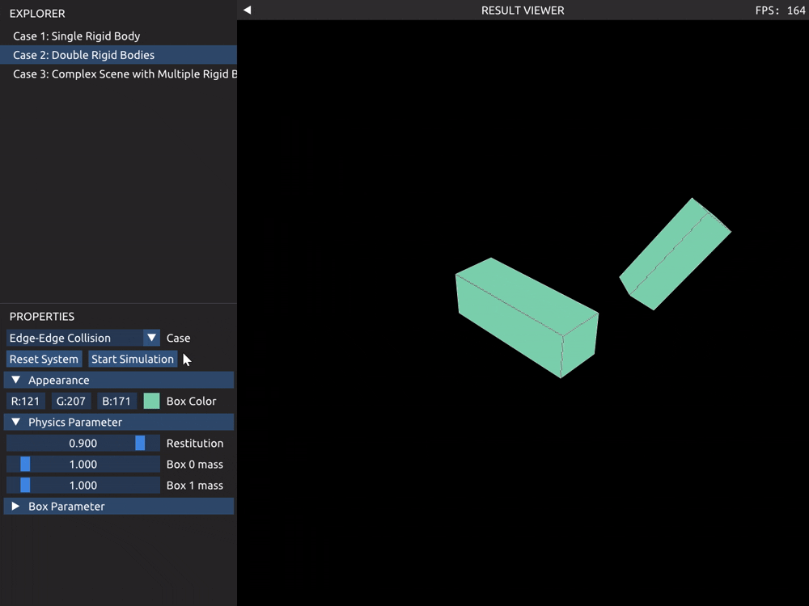
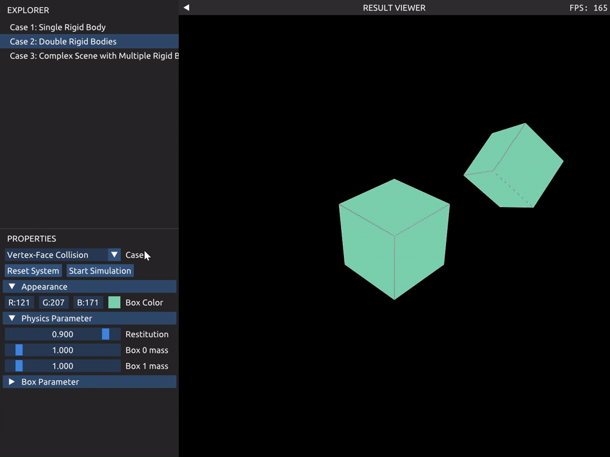
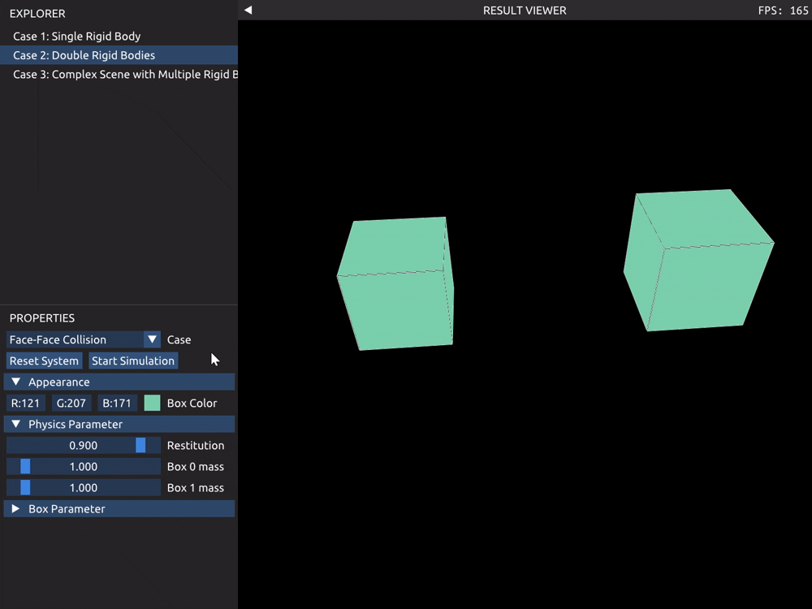
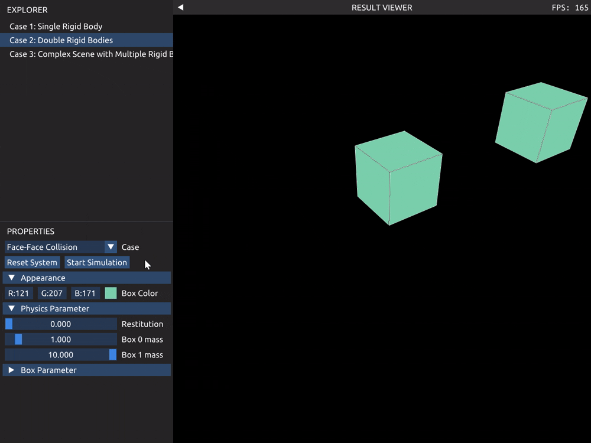
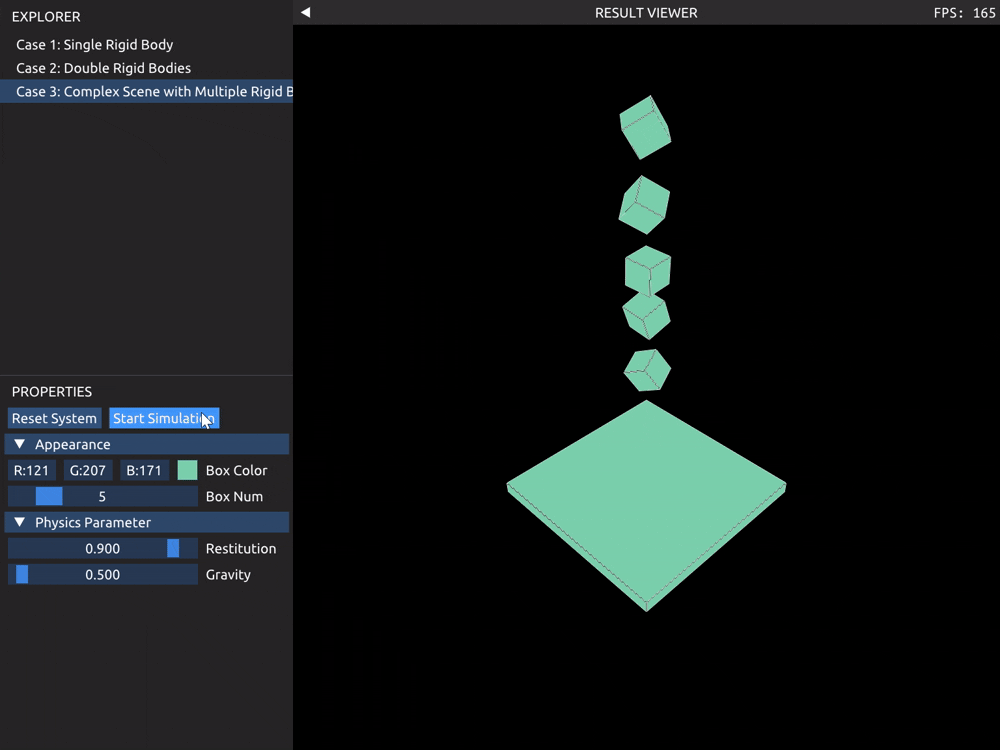

# Lab 1 报告

## Case 1 单个刚体

在左下角可以显式调整刚体的一些参数。可以按住 Alt 键使用鼠标左键对刚体施加外力。其中力的作用点为鼠标对应的射线与长方体的交点，通过slab方法判断鼠标是否与长方体相交。具体代码见[ExternalForceManager.cpp](../src/VCX/Labs/Common/ExternalForceManager.cpp)。

## Case 2 两个刚体

在左下角可以选择展示的3个碰撞情景，调整部分参数，重置场景，停止和开始模拟。碰撞处理代码见[Collision.cpp](../src/VCX/Labs/1-RigidBody/Collision.cpp)。

边-边碰撞：

点-面碰撞：

面-面碰撞：（这里两个面没有正对因此有力矩）

改变恢复系数和质量后：

## Case 3 多刚体的复杂场景

场景包含一个固定地面和若干从高处以随机位置和随机朝向自由下落的小刚体。在左下角可以调整小刚体数量和物理参数，重置场景，停止和开始模拟。可以使用 Alt 键加鼠标左键对小刚体施加外力。代码中为`Box`类添加了`Fixed`成员，`Fixed`设置为`true`的`Box`速度和角速度始终为零且不会被更新。

